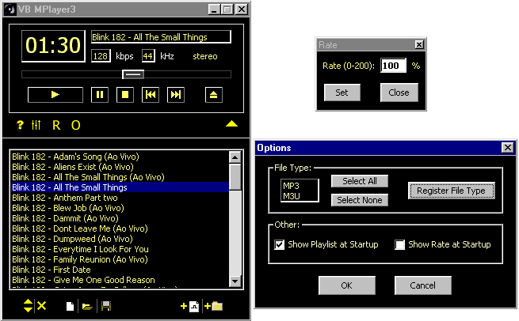



## VB MPlayer3 a compl API MP3 Player \(w slider\) \(MUST SEE\)

### Description

VB MPlayer3 is a complete MP3 Player using only API Calls.

NO OCX NO OCX NO OCX NO OCX NO OCX... I HATE OCX.

What has it?

COOL: Time line(you can slide it) like WinAmp, and fully functional controls.

MP3 INFO: It gets the bitrate, frequency and mode of each MP3 file.

COOL: With it you can modify the RATE of the MP3.

FILE ASSOCIATION: You can register the file types.

PLAYLIST: The controls of playlist are fully functional.

It saves the items of playlist and the last listened music

to the next time you run the MPlayer3.

Sorry guys, but it is like WinAmp. I don't have any idea

about how to make a different MP3 Player.

And sorry my English.

VOTE FOR ME PLEASE, IT'S A GREAT PROGRAM.

LEAVE A FEEDBACK.
 
### More Info
 

             |
---                |---
**Submitted On**   |2001-09-24 12:56:38
**By**             |[Frederico Machado](https://github.com/Planet-Source-Code/PSCIndex/blob/master/ByAuthor/frederico-machado.md)
**Level**          |Advanced
**User Rating**    |4.7 (90 globes from 19 users)
**Compatibility**  |VB 6\.0
**Category**       |[Complete Applications](https://github.com/Planet-Source-Code/PSCIndex/blob/master/ByCategory/complete-applications__1-27.md)
**World**          |[Visual Basic](https://github.com/Planet-Source-Code/PSCIndex/blob/master/ByWorld/visual-basic.md)
**Archive File**   |[VB MPlayer269089242001\.zip](https://github.com/Planet-Source-Code/frederico-machado-vb-mplayer3-a-compl-api-mp3-player-w-slider-must-see__1-27516/archive/master.zip)

